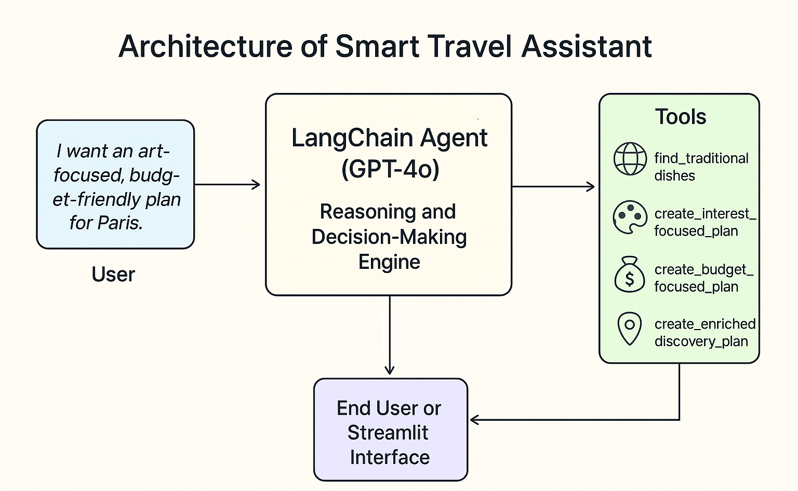

# AI Smart Travel Assistant

This is an intelligent travel assistant built with Python, LangChain, and Streamlit. It uses a multi-tool AI agent powered by GPT-4o to create personalized travel itineraries based on user interests and budget.



## Features
- **Interactive Map:** Visualizes recommendations on an interactive map using Leaflet.js.
- **Multi-Tool Agent:** Uses a chain of tools to:
  1.  Research local cuisine via web search.
  2.  Create plans based on user's **interest** (art, nature, etc.) or **budget** (cheap, luxury).
  3.  Gracefully handles failures with a fallback mechanism.
- **Geographically Aware:** Uses geocoding to prevent irrelevant, out-of-city suggestions.


## How to Run
1.  Clone the repository.
2.  Create a virtual environment: `python3 -m venv venv`
3.  Activate it: `source venv/bin/activate`
4.  Install the dependencies: `pip install -r requirements.txt`
5.  Create a `.streamlit/secrets.toml` file and add your API keys:
    ```toml
    OPENAI_API_KEY = "sk-..."
    GOOGLE_API_KEY = "AIza..."
    ```
6.  Run the Streamlit app: `streamlit run app.py`

## Technologies Used
- **Backend & Agent:** Python, LangChain, OpenAI GPT-4o
- **APIs:** Google Maps (Geocoding, Places)
- **Web Search:** DuckDuckGo
- **Frontend:** Streamlit
- **Mapping:** Leaflet.js